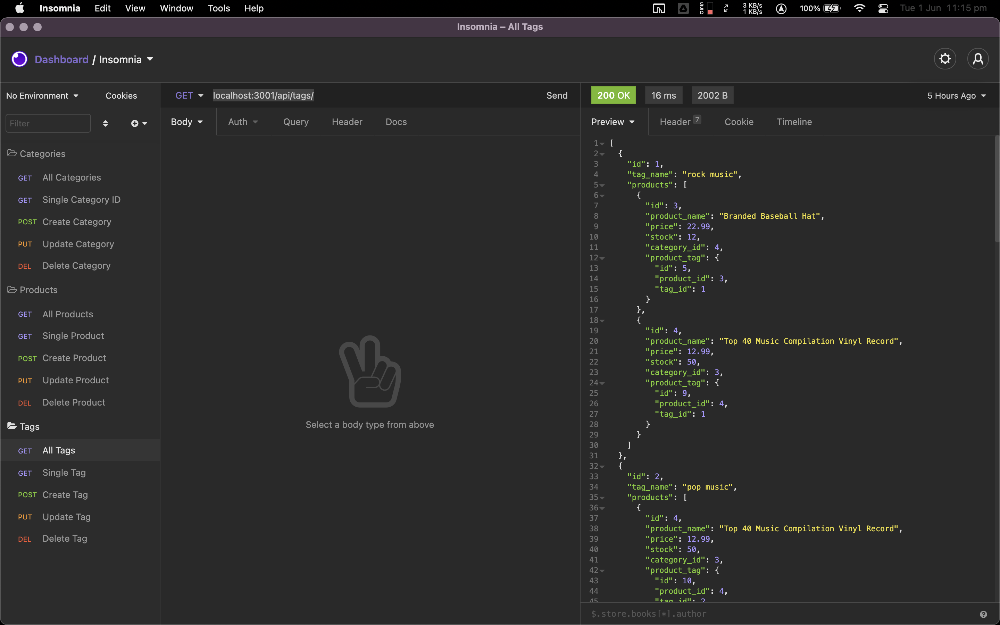
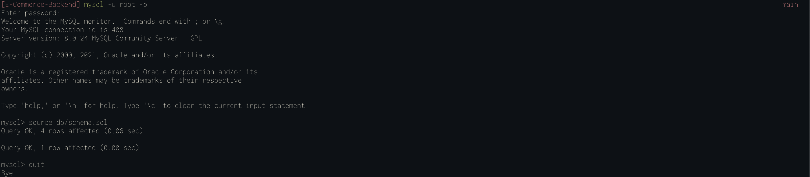
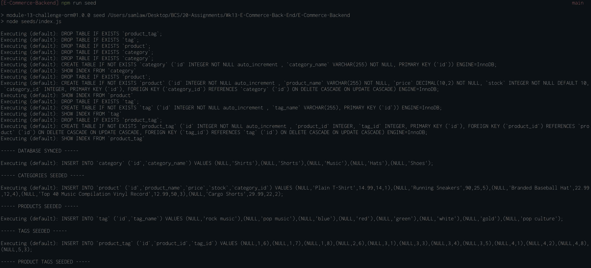

# E-Commerce-Backend



## Description 
Our clients are in the process of creating an online store and needed some help in building the back-end functionality.  We created some models & routes for them to use.

[Walkthrough Video](https://drive.google.com/file/d/1mWCLKPy30O50la0oHR80dt8Vlf_5rtJa/view?usp=sharing)


SQL database creation


Database seeding

## Installation
- Clone the repository
- Run ```npm i``` to install dependancies
- Enter database, username and password
- Create the Database using the SQL Shell:
    - in the terminal run ```mysql -u root -p```
    - enter your mysql password
    - type ```source db/schema.sql```
    - enter ```quit``` to exit SQL shell
- Seed the database with test data using ```npm run seed```

## Usage  
- Run ```npm start``` to start the server.
- Using Insomnia Core, use routes for Categories, Products & Tags on ```localhost:3001``` e.g. ```localhost:3001/api/categories/``` | ```localhost:3001/api/products/``` | ```localhost:3001/api/tags/```


## Technologies
- Node.js, using express, dotenv, sequelize
- SQL

## License 
This project is licensed under 

For more information, please visit: https://opensource.org/licenses/MIT
